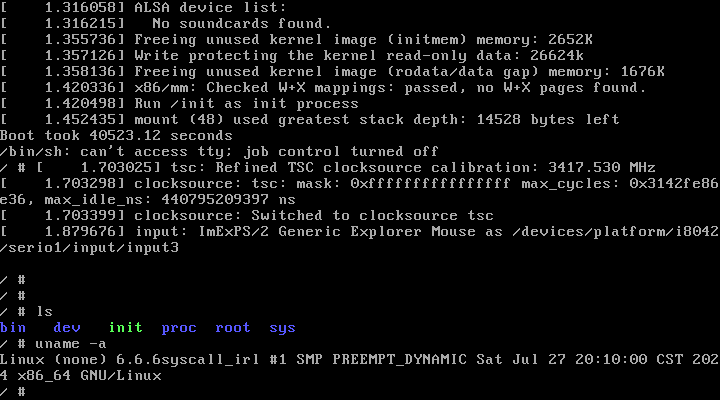

<!-- Summary -->

In the Linux world, **syscall** in most case is the only way for userspace programs to interact with kernel, and utilize the full power that the Linux kernel offers.

In this blog, we will take a deep dive into Linux system call, not theoretically, but practically. We will start from the very beginning, and gradually build up a full picture of Linux system call.

<!--more-->

<!-- Main Content -->

## Intro

It's easy to do a syscall in C code, like the following:

```c
// write.c
#include <unistd.h>
int main() {
    write(1, "Hello World!\n", 13);
    return 0;
}

/*
$ gcc -o write write.c && ./write
Hello, World!
*/
```

This simple example does only one thing: print `"Hello World!"` to file descriptor `1`, which stands for `stdout`. But what if I want to do the same thing in other language?

Most languages simply reused the same library that C uses, which is called `libc`. There are many implementations of `libc`, but the most popular one is [GNU C Library](https://www.gnu.org/software/libc/), or `glibc` for short. `glibc` is the default `libc` implementation for most Linux distributions, there are also other implementations like [musl](https://musl.libc.org/) that provides different features.

You may also heard that Go can do syscall without `libc`[^1] because it has its own runtime that can do syscall directly, so Go program could be built *totally static* and can run without any dependency. That makes Go program very portable, especially suitable for ops-tools that need to run on different environments.

So it seems that syscall can be language-agnostic, and there must be some common protocols that all languages can follow, that is, the [**ABI**](https://en.wikipedia.org/wiki/Application_binary_interface).

In the context of syscall, the most significant part of ABI is [**Calling Convention**](https://en.wikipedia.org/wiki/Calling_convention), which basically defines what to do when you want to do a procedure call in the binary level.

With following the calling convention, we can not only do syscall in different languages, and can also call procedures written in another language. The latter case is even more often because most languages do syscall by calling a C syscall wrapper defined in `libc`.

Before we dive into the details of syscall, let's take a look at some normal procedure calls first and see what calling convention looks like.

### Example: `sum3`

```c
// sum3.c
int sum3(int a, int b, int c) {
    return a + b + c;
}
int main(void) {
    int sum = sum3(1, 2, 3);
    return 0;
}
```

The `main` function in this simple C program calls a function `sum3` to calculate the sum of three integers, and save the result to variable `sum`. Let's compile and disassemble it to see what assembly code it generates:

```asm
# gcc -O0 -o sum3 sum3.c && objdump -d --no-show-raw-insn sum3
# ...
0000000000001119 <sum3>:
    1119:	push   %rbp
    111a:	mov    %rsp,%rbp
    111d:	mov    %edi,-0x4(%rbp)
    1120:	mov    %esi,-0x8(%rbp)
    1123:	mov    %edx,-0xc(%rbp)
    1126:	mov    -0x4(%rbp),%edx
    1129:	mov    -0x8(%rbp),%eax
    112c:	add    %eax,%edx
    112e:	mov    -0xc(%rbp),%eax
    1131:	add    %edx,%eax
    1133:	pop    %rbp
    1134:	ret

0000000000001135 <main>:
    1135:	push   %rbp
    1136:	mov    %rsp,%rbp
    1139:	sub    $0x10,%rsp
    113d:	mov    $0x3,%edx
    1142:	mov    $0x2,%esi
    1147:	mov    $0x1,%edi
    114c:	call   1119 <sum3>
    1151:	mov    %eax,-0x4(%rbp) # sum = %eax
    1154:	mov    $0x0,%eax
    1159:	leave
    115a:	ret
# ...
```

As we can see, in the `main` function, first the parameters `(1,2,3)` are placed in registers `%edi`, `%esi`, `%edx` respectively, then does the `call` instruction with `1119`, the address of `sum3`, as operand, and finally the return value is placed in register `%eax`.

So let's conclude: **first, place parameters in registers in a proper order, then execute the `call` instruction with the address of the function you want to call as operand. After the function returns, you can get the return value from register `%eax`.**

### Example: `bigret`

But here comes a question: since all parameters and return value are placed in registers in this example, and registers are typically only 64-bit in size, what if we want to pass a parameter or return a value that is larger than 64-bit, like a `struct`? Let's find out with some experiments:

```c
// bigret.c
typedef unsigned long long u64;

struct big {
    u64 a, b, c;
};

struct big ret_big(u64 a, u64 b, u64 c) {
    return (struct big){a, b, c};
}

int main(void) {
    struct big big = ret_big(1, 2, 3);
    return 0;
}
```

Again, compile and disassemble:

```asm
# gcc -O0 -o bigret bigret.c && objdump -d --no-show-raw-insn bigret
# ...
0000000000001139 <ret_big>:
    1139:	push   %rbp
    113a:	mov    %rsp,%rbp
    113d:	mov    %rdi,-0x28(%rbp)
    1141:	mov    %rsi,-0x30(%rbp)
    1145:	mov    %rdx,-0x38(%rbp)
    1149:	mov    %rcx,-0x40(%rbp)
    114d:	mov    -0x28(%rbp),%rax
    1151:	mov    -0x30(%rbp),%rdx
    1155:	mov    %rdx,(%rax)
    1158:	mov    -0x28(%rbp),%rax
    115c:	mov    -0x38(%rbp),%rdx
    1160:	mov    %rdx,0x8(%rax)
    1164:	mov    -0x28(%rbp),%rax
    1168:	mov    -0x40(%rbp),%rdx
    116c:	mov    %rdx,0x10(%rax)
    1170:	mov    -0x28(%rbp),%rax
    1174:	pop    %rbp
    1175:	ret

0000000000001176 <main>:
    1176:	push   %rbp
    1177:	mov    %rsp,%rbp
    117a:	sub    $0x20,%rsp
    117e:	mov    %fs:0x28,%rax
    1187:	mov    %rax,-0x8(%rbp)
    118b:	xor    %eax,%eax
    118d:	lea    -0x20(%rbp),%rax
    1191:	mov    $0x3,%ecx
    1196:	mov    $0x2,%edx
    119b:	mov    $0x1,%esi
    11a0:	mov    %rax,%rdi
    11a3:	call   1139 <ret_big>
    11a8:	mov    $0x0,%eax
    11ad:	mov    -0x8(%rbp),%rdx
    11b1:	sub    %fs:0x28,%rdx
    11ba:	je     11c1 <main+0x4b>
    11bc:	call   1030 <__stack_chk_fail@plt>
    11c1:	leave
    11c2:	ret
# ...
```

Hmm...interesting, it looks like an address is passed as the first parameter to `ret_big` implicitly, and the return value is the same address. Let's see what's going on step by step:

In `main`:

1. `117a: sub $0x20,%rsp`: we all know that the stack grows from higher address to lower address, so subtract the stack pointer `$rsp`(register stack pointer) by `0x20(32)` actually allocate `32` bytes on stack, which in address range from `%rbp-0x20` to `%rbp`. We can see it as an `u64[4]` array.
2. `117e: mov %fs:0x28,%rax`: read a value from address `%fs+0x28` to `%rax`.
3. `1187: mov %rax,-0x8(%rbp)`: save the read value on stack at address `(%rbp-0x8)`, or `arr[3]`.
4. `118b: xor %eax,%eax`: set `%eax` to `0`.
5. `118d: lea -0x20(%rbp),%rax`: load the address of `%rbp-0x20` to `%rax`, which is `&arr[0]`.
6. `1191` - `11a0`: place parameters in registers in order with shifting by one position, since `$eax` is the first parameter now.
7. `113a call 1139 <ret_big>`: call `ret_big`.

The code in `ret_big` is a little verbose, but if we recompile it with flag `-O1`, it instantly become much simpler:

```asm
0000000000001119 <ret_big>:
    1119:	mov    %rdi,%rax
    111c:	mov    %rsi,(%rdi)
    111f:	mov    %rdx,0x8(%rdi)
    1123:	mov    %rcx,0x10(%rdi)
    1127:	ret
```

Since the first parameter `$rdi` is the address of the array `arr` that we allocated before, and the three parameters we passed to `ret_big` are placed in registers `$rsi`, `$rdx`, `$rcx` respectively, this code simply copy the three parameters to the array `arr` in order:

1. `111c: mov %rsi,(%rdi)`: `arr[0] = %rdi`.
2. `111f: mov %rdi,0x8(%rdi)`: `arr[1] = %rsi`.
3. `1123: mov %rcx,0x10(%rdi)`: `arr[2] = %rdx`.
4. `1127: ret`: return `arr`

Now it's clear, **if we want to return a large chunk of data which can not fit in a register, we pass an address for the return value and let the function save it at that address.**

Since we just pass an address, it might happen that the function write more data than we expected, which will cause [**buffer overflow**](https://en.wikipedia.org/wiki/Buffer_overflow) that may results in a segment error or worse, an [**ACE**](https://en.wikipedia.org/wiki/Arbitrary_code_execution). So how can we prevent this from happening?

### Canary: The Guardian of Stack

You might notice that the fourth instruction in `main`(step 3) put a secret value on stack at the location `arr[3]`, which is the last element of the array `arr` we allocated.

Most buffer overflow attacks are based on the fact that the attacker can take an unbounded string as input, and if we use `\0` as the input delimiter, then the program will write the user input along the buffer and overwrite the memory that doesn't belong to the buffer, which may stores the return address.

After `ret_big` returns, the `main` instantly check if the secret value is changed, that is, instructions from `11ad` to `11ba`. If the secret value is not changed, it means the following memory contents are also not changed too, so the program thinks it's safe and will jump to instruction at `<main+0x4b>`, which is `11c1`, and returns normally. But if not, it will assume the memory after that value is altered, and will call `__stack_chk_fail` to terminate the program to prevent more damages from happening.

This secret value is called [**Canary**](https://en.wikipedia.org/wiki/Buffer_overflow_protection#Canaries), and it is a common technique to defend buffer overflow attacks. This terminology itself is a reference to the historic practice of using canaries in coal mines to warn miners toxic gases, which is another somber story[^2].

### Calling Convention

There are many details defined by calling convention, since we are focusing on syscall topic, only the following details are important to us:

 - **Where parameters are placed.**
 - **The order in which parameters are passed.**
 - **How the stack changes during the call**
 - **How return values are delivered back to the caller.**
 - **Which registers are guaranteed to have the same value before and after the call.**

From the two examples above, we already know the first three, and rest of them is defined in the following specification(defines at `arch/x86/entry/calling.h` in Linux kernel source code):

```plain
x86 function call convention, 64-bit:
-------------------------------------
 arguments           |  callee-saved      | extra caller-saved | return
[callee-clobbered]   |                    | [callee-clobbered] |
---------------------------------------------------------------------------
rdi rsi rdx rcx r8-9 | rbx rbp [*] r12-15 | r10-11             | rax, rdx [**]

( rsp is obviously invariant across normal function calls. (gcc can 'merge'
  functions when it sees tail-call optimization possibilities) rflags is
  clobbered. Leftover arguments are passed over the stack frame.)

[*]  In the frame-pointers case rbp is fixed to the stack frame.

[**] for struct return values wider than 64 bits the return convention is a
     bit more complex: up to 128 bits width we return small structures
     straight in rax, rdx. For structures larger than that (3 words or
     larger) the caller puts a pointer to an on-stack return struct
     [allocated in the caller's stack frame] into the first argument - i.e.
     into rdi. All other arguments shift up by one in this case.
     Fortunately this case is rare in the kernel.
```

Normally, the `callee-saved` means the caller can assume that the value of the register is not changed after the call, so the function itself should save the origin value of the register before using it for other purposes. And the `callee-clobbered` means the caller can not assume that so it need to manually save it before the call if it want to use it after the call.

Now we have a necessary understanding of calling convention, let's go deeper and see how syscall is implemented.

## Userspace Stub

So how does *syscall* happens, actually? If you look up the definition of the `write`, you will see the following function signature:

```c
/* Write N bytes of BUF to FD.  Return the number written, or -1.

   This function is a cancellation point and therefore not marked with
   __THROW.  */
extern ssize_t write (int __fd, const void *__buf, size_t __n) __wur
    __attr_access ((__read_only__, 2, 3));
```

But we still don't know exactly what happens when we call it. All we know is that it's like a normal C function: we call it, and everything gets done.

### `write` in userspace


Since the source code of `libc` is open to everyone, we can look up how `write` is implemented. But before doing that, let's use `gdb` to find out what actually happens.

```c
// write.c
#include <unistd.h>
int main() {
    write(1, "Hello, World!\n", 14);
    return 0;
}
```

After compiling this simple code with `gcc -O1 -g -o write write.c`[^3], we get an executable named `write`. All it does is print the string "Hello, World!".

```plain
$ ./write
Hello, World!
```

Now we'll use `gdb` to run the executable again.

```plain
$ gdb write
...(Messages printed at start)
(gdb)
```

First, set a breakpoint at the `main` symbol to stop at the entry point. Then enable the `disassemble-next-line` option and run the program.

```gdb
(gdb) b main
Breakpoint 1 at 0x1139: file write.c, line 3.
(gdb) set disassemble-next-line on
(gdb) show disassemble-next-line
Debugger's willingness to use disassemble-next-line is on.
(gdb) r
Starting program: ./write

Breakpoint 1, main () at write.c:3
3       int main() {
=> 0x0000555555555139 <main+0>: 48 83 ec 08             sub    $0x8,%rsp
```

We can see from the assembly code that the stack grows by `0x8` bytes, giving `main` a stack size of `0x8` bytes. However, that's not our focus. Let's execute this program instruction-by-instruction using `si` (step instruction).

```gdb
(gdb) si
4         write(1, "Hello, World!\n", 14);
=> 0x000055555555513d <main+4>: ba 0e 00 00 00          mov    $0xe,%edx
   0x0000555555555142 <main+9>: 48 8d 35 bb 0e 00 00    lea    0xebb(%rip),%rsi        # 0x555555556004
   0x0000555555555149 <main+16>:        bf 01 00 00 00          mov    $0x1,%edi
   0x000055555555514e <main+21>:        e8 dd fe ff ff          call   0x555555555030 <write@plt>
```

From the last blog, we know that arguments are passed by registers in the order of `rdi`, `rsi`, `rdx`, `rcx`, `r8`, and `r9`. We can see that `rdi`, `rsi`, `edx` are assigned to `0x1(1)`, `%rip + 0xebb` (which is annotated as `0x555555556004`), and `0xe(14)` respectively. That's exactly what we passed to the `write` function. The second argument(`"Hello, World!\n"`) is passed by pointer though, we can verify this by checking what resides at this pointer:

```gdb
(gdb) x/s 0x555555556004
0x555555556004: "Hello, World!\n"
```

OK, now that we understand argument passing, let's dive into the `write` function.

```gdb
(gdb) s
__GI___libc_write (fd=fd@entry=1, buf=buf@entry=0x555555556004, nbytes=nbytes@entry=14) at ../sysdeps/unix/sysv/linux/write.c:25

```

We can even see what is passed to which parameter thanks to the GDB debuginfod feature, but we already know that, so let's print out the assembly code of the `__GI___libc_write`[^4]:

```gdb
(gdb) x/16i $pc
=> 0x7ffff7e9b4f0 <__GI___libc_write>:  endbr64
   0x7ffff7e9b4f4 <__GI___libc_write+4>:        cmpb   $0x0,0xe0b45(%rip)        # 0x7ffff7f7c040 <__libc_single_threaded>
   0x7ffff7e9b4fb <__GI___libc_write+11>:       je     0x7ffff7e9b510 <__GI___libc_write+32>
   0x7ffff7e9b4fd <__GI___libc_write+13>:       mov    $0x1,%eax
   0x7ffff7e9b502 <__GI___libc_write+18>:       syscall
   0x7ffff7e9b504 <__GI___libc_write+20>:       cmp    $0xfffffffffffff000,%rax
   0x7ffff7e9b50a <__GI___libc_write+26>:       ja     0x7ffff7e9b560 <__GI___libc_write+112>
   0x7ffff7e9b50c <__GI___libc_write+28>:       ret
   0x7ffff7e9b50d <__GI___libc_write+29>:       nopl   (%rax)
   0x7ffff7e9b510 <__GI___libc_write+32>:       push   %rbp
   0x7ffff7e9b511 <__GI___libc_write+33>:       mov    %rsp,%rbp
   0x7ffff7e9b514 <__GI___libc_write+36>:       sub    $0x20,%rsp
   0x7ffff7e9b518 <__GI___libc_write+40>:       mov    %rdx,-0x18(%rbp)
   0x7ffff7e9b51c <__GI___libc_write+44>:       mov    %rsi,-0x10(%rbp)
   0x7ffff7e9b520 <__GI___libc_write+48>:       mov    %edi,-0x8(%rbp)
   0x7ffff7e9b523 <__GI___libc_write+51>:       call   0x7ffff7e20d90 <__GI___pthread_enable_asynccancel>
```

Well, it's quite verbose, but we only need to focus on two lines:

```gdb
   0x7ffff7e9b4fd <__GI___libc_write+13>:       mov    $0x1,%eax
   0x7ffff7e9b502 <__GI___libc_write+18>:       syscall
```

These codes simply set the `eax` register to `0x1` and then execute the `syscall` instruction.

```gdb
(gdb) x/i $pc
=> 0x7ffff7e9b502 <__GI___libc_write+18>:       syscall
(gdb) si
Hello, World!
(gdb)
```

After the `syscall` instruction returns, we can see "Hello, World!" from the GDB console. The entire process can be summarized in three steps:

1. Pass the arguments following the C Calling Convention.
2. Set the `rax` register (or `eax` in 32-bit mode) to a number specified as the *syscall number* in Linux documentation.
3. Execute the `syscall` instruction[^5].

This is surprisingly simple, we can just set an extra register `rax` to the required syscall number, replace the `call` instruction with `syscall`, and an normal C function call becomes a syscall. We can even create our own `write` function with just the two lines of assembly code above.

However, there is actually another small difference in the calling convention: for syscalls, the fourth argument is passed via register `r10` instead of `rcx`. This is because `syscall` need to store the address of the next userspace instruction in register `rcx`, so after returning from kernel, execution can continue at that saved address.

### Glibc syscall stub

Previously, we use GDB to understand what happens with `write` under the hood.  Now, let's examine the code to see how `write` is implemented. You can skip this chapter if you're not familiar with or interested in C macro magic.

The following code is based on `glibc-2.38`, which you can download from the [GNU FTP server](https://ftp.gnu.org/gnu/glibc/glibc-2.38.tar.xz). The definition of `write` isn't straightforward; it involves expanding complex macros dynamically. After manually expanding these magic-like macros, the simplified `write.c` looks like this:

```c
define __glibc_unlikely

/* NB: This also works when X is an array.  For an array X,  type of
   (X) - (X) is ptrdiff_t, which is signed, since size of ptrdiff_t
   == size of pointer, cast is a NOP.   */
#define TYPEFY1(X) __typeof__ ((X) - (X))
/* Explicit cast the argument.  */
#define ARGIFY(X) ((TYPEFY1 (X)) (X))
/* Create a variable 'name' based on type of variable 'X' to avoid
   explicit types.  */
#define TYPEFY(X, name) __typeof__ (ARGIFY (X)) name

typedef int ssize_t;
typedef unsigned int size_t;

extern int __libc_single_threaded;
extern int __libc_errno;

int __pthread_enable_asynccancel();
void __pthread_disable_asynccancel(int);

#define __NR_write 1

#define internal_syscall3(number, arg1, arg2, arg3)			\
({									\
    unsigned long int resultvar;					\
    TYPEFY (arg3, __arg3) = ARGIFY (arg3);			 	\
    TYPEFY (arg2, __arg2) = ARGIFY (arg2);			 	\
    TYPEFY (arg1, __arg1) = ARGIFY (arg1);			 	\
    register TYPEFY (arg3, _a3) asm ("rdx") = __arg3;			\
    register TYPEFY (arg2, _a2) asm ("rsi") = __arg2;			\
    register TYPEFY (arg1, _a1) asm ("rdi") = __arg1;			\
    asm volatile (							\
    "syscall\n\t"							\
    : "=a" (resultvar)							\
    : "0" (number), "r" (_a1), "r" (_a2), "r" (_a3)			\
    : "memory", REGISTERS_CLOBBERED_BY_SYSCALL);			\
    (long int) resultvar;						\
})

/* Write NBYTES of BUF to FD.  Return the number written, or -1.  */
ssize_t
__libc_write (int fd, const void *buf, size_t nbytes)
{
    long int ret;
    if (__libc_single_threaded != 0)
    {
        long int sc_ret = internal_syscall3 (__NR_write, fd, buf, nbytes);
        if (__glibc_unlikely ((unsigned long int) (sc_ret) > -4096UL)) {
            __libc_errno = -sc_ret;
            ret = -1L;
        } else {
            ret = sc_ret;
        }
    }
    else
    {
        int sc_cancel_oldtype = __pthread_enable_asynccancel();
        long int sc_ret = internal_syscall3 (__NR_write, fd, buf, nbytes);
        if (__glibc_unlikely ((unsigned long int) (sc_ret) > -4096UL)) {
            __libc_errno = -sc_ret;
            ret = -1L;
        } else {
            ret = sc_ret;
        }
        __pthread_disable_asynccancel(sc_cancel_oldtype);
    }
    return ret;
}
libc_hidden_def (__libc_write)

// weak_alias (__libc_write, __write)
// libc_hidden_weak (__write)
// weak_alias (__libc_write, write)
// libc_hidden_weak (write)

int main(void) {
    write(1, "Hello, world!\n", 14);
    return 0;
}
```

The main part of `write` is in `__libc_write`, where we can see the `pthread` synchronization guard that we saw earlier in the GDB disassembly. The syscall number for `write` is defined in the macro `__NR_write`, which is `1`. The actual arguments are already passed outside of the `write`, so the internal syscall stub only cares about the number of arguments. Here, we have `internal_syscall3`, which use inline assembly to call the instruction `syscall`. However, if we look at the `internal_syscall4`, we will notice some differences:

```c
#define internal_syscall4(number, arg1, arg2, arg3, arg4)		\
({									\
    unsigned long int resultvar;					\
    TYPEFY (arg4, __arg4) = ARGIFY (arg4);			 	\
    TYPEFY (arg3, __arg3) = ARGIFY (arg3);			 	\
    TYPEFY (arg2, __arg2) = ARGIFY (arg2);			 	\
    TYPEFY (arg1, __arg1) = ARGIFY (arg1);			 	\
    register TYPEFY (arg4, _a4) asm ("r10") = __arg4;			\
    register TYPEFY (arg3, _a3) asm ("rdx") = __arg3;			\
    register TYPEFY (arg2, _a2) asm ("rsi") = __arg2;			\
    register TYPEFY (arg1, _a1) asm ("rdi") = __arg1;			\
    asm volatile (							\
    "syscall\n\t"							\
    : "=a" (resultvar)							\
    : "0" (number), "r" (_a1), "r" (_a2), "r" (_a3), "r" (_a4)		\
    : "memory", REGISTERS_CLOBBERED_BY_SYSCALL);			\
    (long int) resultvar;						\
})
```

As we mentioned, the fourth argument is assigned to register `r10` instead of `rcx`; besides that, nothing is different.

### Prepare for entering kernel space

From the userspace perspective, we only see an instruction being executed, and the job is done. But what happens behind the scenes? The [online x86 reference](https://www.felixcloutier.com/x86/) gives an detailed operation specification of the `syscall` instruction:

```plain
IF (CS.L ≠ 1 ) or (IA32_EFER.LMA ≠ 1) or (IA32_EFER.SCE ≠ 1)
(* Not in 64-Bit Mode or SYSCALL/SYSRET not enabled in IA32_EFER *)
    THEN #UD;
FI;
RCX := RIP; (* Will contain address of next instruction *)
RIP := IA32_LSTAR;
R11 := RFLAGS;
RFLAGS := RFLAGS AND NOT(IA32_FMASK);
CS.Selector := IA32_STAR[47:32] AND FFFCH (* Operating system provides CS; RPL forced to 0 *)
(* Set rest of CS to a fixed value *)
CS.Base := 0;
                (* Flat segment *)
CS.Limit := FFFFFH;
                (* With 4-KByte granularity, implies a 4-GByte limit *)
CS.Type := 11;
                (* Execute/read code, accessed *)
CS.S := 1;
CS.DPL := 0;
CS.P := 1;
CS.L := 1;
                (* Entry is to 64-bit mode *)
CS.D := 0;
                (* Required if CS.L = 1 *)
CS.G := 1;
                (* 4-KByte granularity *)
IF ShadowStackEnabled(CPL)
    THEN (* adjust so bits 63:N get the value of bit N–1, where N is the CPU’s maximum linear-address width *)
        IA32_PL3_SSP := LA_adjust(SSP);
            (* With shadow stacks enabled the system call is supported from Ring 3 to Ring 0 *)
            (* OS supporting Ring 0 to Ring 0 system calls or Ring 1/2 to ring 0 system call *)
            (* Must preserve the contents of IA32_PL3_SSP to avoid losing ring 3 state *)
FI;
CPL := 0;
IF ShadowStackEnabled(CPL)
    SSP := 0;
FI;
IF EndbranchEnabled(CPL)
    IA32_S_CET.TRACKER = WAIT_FOR_ENDBRANCH
    IA32_S_CET.SUPPRESS = 0
FI;
SS.Selector := IA32_STAR[47:32] + 8;
                (* SS just above CS *)
(* Set rest of SS to a fixed value *)
SS.Base := 0;
                (* Flat segment *)
SS.Limit := FFFFFH;
                (* With 4-KByte granularity, implies a 4-GByte limit *)
SS.Type := 3;
                (* Read/write data, accessed *)
SS.S := 1;
SS.DPL := 0;
SS.P := 1;
SS.B := 1;
                (* 32-bit stack segment *)
SS.G := 1;
                (* 4-KByte granularity *)
```

The pseudo code above contains many variable-like identifiers that are actually registers, including [General Purpose Registers](https://wiki.osdev.org/CPU_Registers_x86-64#General_Purpose_Registers) (`RCX`, `R11`), [Pointer Registers](https://wiki.osdev.org/CPU_Registers_x86-64#Pointer_Registers) (`RIP`), [Segment Registers](https://wiki.osdev.org/CPU_Registers_x86-64#Segment_Registers) (`CS`, `SS`), the [RFLAGS Register](https://wiki.osdev.org/CPU_Registers_x86-64#RFLAGS_Register) (`RFLAGS`), and [Model-Specific Registers (MSRs)](https://wiki.osdev.org/CPU_Registers_x86-64#MSRs) (`IA32_EFER`, `IA32_LSTAR`,  `IA32_FMASK`, `IA32_PL3_SSP`). The operator `.` accesses specific bit fields within these registers. Despite the numerous operations occurring, we only need to focus on a few:

```plain
RCX := RIP; (* Save address of next instruction(userspace) to RCX *)
RIP := IA32_LSTAR; (* Set address of next instruction(kernel) to IA32-LSTAR *)
R11 := RFLAGS; (* Save old RFLAGS to R11 *)
RFLAGS := RFLAGS AND NOT(IA32_FMASK); (* Clear some flags *)
CPL := 0; (* Set current privilege level to 0, also known as Protection Ring *)
```

Basically, the `syscall` instruction backs up some userspace context information (such as the return address), sets the next instruction pointer (`RIP`) to somewhere in kernel space (`IA32-LSTAR`), and switches the protection ring to `0`, which is kernel mode. For security reasons, only in this mode can the CPU execute kernel code.

It's important to note that all of this occurs within a single `syscall` instruction, so set `RIP` to point to kernel space does make sense. After executing this instruction, we are finally in kernel space.

## Prepare runnable kernel

To show exactly what happened, we will use QEMU[^6] and GDB to debugging a running kernel. But first, we need to prepare a runnable Linux kernel image, that means we need to compile the kernel.

### Compiling the Linux kernel

For a general C project, the basic building progress is in three steps, even the Linux kernel has no difference.

#### Get the source

You can get every released Linux kernel source from [kernel.org](https://kernel.org). I will use the version [6.6.6](https://cdn.kernel.org/pub/linux/kernel/v6.x/linux-6.6.6.tar.xz) for now, but you can use any version you like. Also don't forget download the [GPG signature of the version](https://cdn.kernel.org/pub/linux/kernel/v6.x/linux-6.10.2.tar.sign).

```shell
# Download source tarball
curl -OL https://cdn.kernel.org/pub/linux/kernel/v6.x/linux-6.6.6.tar.xz
# Download signature
curl -OL https://cdn.kernel.org/pub/linux/kernel/v6.x/linux-6.6.6.tar.sign
# Uncompressing source
unxz linux-6.6.6.tar.xz
# Import keys belonging to Linus Torvalds and Greg Kroah-Hartman
gpg2 --locate-keys torvalds@kernel.org gregkh@kernel.org
# Verify the .tar archive with the signature
gpg2 --verify linux-6.6.6.tar.sign
```

If everything was right, you will see the following output(make sure you see `gpg: Good signature` in the output), that means the kernel source tree you got was not modified or tampered after releasd by the kernel developer.

```plain
gpg: assuming signed data in 'linux-6.6.6.tar'
gpg: Signature made Mon 11 Dec 2023 05:40:57 PM CST
gpg:                using RSA key 647F28654894E3BD457199BE38DBBDC86092693E
gpg: Good signature from "Greg Kroah-Hartman <gregkh@kernel.org>" [unknown]
gpg: WARNING: This key is not certified with a trusted signature!
gpg:          There is no indication that the signature belongs to the owner.
Primary key fingerprint: 647F 2865 4894 E3BD 4571  99BE 38DB BDC8 6092 693E
```

Then extract the `.tar` file, and we will get the kernel source tree `linux-6.6.6/`.

#### Configuration

Since we only want to debugging the progress of syscall, it's enough to just use the default configuration.

```shell
cd linux-6.6.6/
make defconfig
```

You can also use the configuration that your Linux distribution use if you like[^7] most distribution save configuration under `/boot/config-$(uname -r)`. If you are using Arch Linux like me, you can find the configuration at `/proc/config.gz`.

If you use a custom configuration, you need to rename it as `.config`(may need uncompress first) and put it under the root of kernel source tree. Then run `make olddefconfig` to use it. There are some useful `make` target for configuration:

```shell
# ncurse based TUI
make nconfig

# X based GUI
make menuconfig

# Print help
make help
```



It's important to enable the kernel debug info, delete or comment out the `CONFIG_DEBUG_INFO_NONE` line, and set the `CONFIG` to `y`. Then run `make olddefconfig` to make the change effective.

For kernel before 5.19.8, there is another config called `CONFIG_DEBUG_INFO=y` to enable the debug info.




We will also add a custom building tag to this configuration, but it's not necessary, feel free to skip this step.

```shell
# Add building tag(optional)
./scripts/config --file .config --set-str LOCALVERSION "syscall_irl"
```

#### Compile

Now everything is ready, there is only one big thing left. Be careful your CPU may catch fire!

```shell
# Build with all available cores, you can change the -j flag to the number of cores you want to use
make -j$(nproc) 2>&1 | tee build.log
```

It takes about 64 seconds on my `i7-13700K` platform with all available cores. If no error was encountered, you should see the following output in the end.

```plain
...
	LD      arch/x86/boot/compressed/vmlinux
	ZOFFSET arch/x86/boot/zoffset.h
	OBJCOPY arch/x86/boot/vmlinux.bin
	AS      arch/x86/boot/header.o
	LD      arch/x86/boot/setup.elf
	OBJCOPY arch/x86/boot/setup.bin
	BUILD   arch/x86/boot/bzImage
Kernel: arch/x86/boot/bzImage is ready  (#1)
```

The last serval steps build the uncompressed linux kernel `vmlinux`, and convert it into a bootable compressed kernel image `bzImage`. You can find it at `arch/x86/boot/bzImage` as the output said.

### Make a root filesystem

Now you can actually run the bootable kernel with `qemu`.

```shell
qemu-system-x86_64 -kernel arch/x86/boot/bzImage
```

But you will find the kernel panics immediately, that's because we provided the kernel itself, but there is still a signaficant part missing: the root filesystem that makes the system work. We need to attach an `initramfs`[^8] that contains a basic root filesystem to provide a functional environment.

#### Filesystem structure

Since we use `initramfs` to only run the kernel, not for switching to a real disk-based root filesystem, we only need to create three directories, `sys/` for mount `sysfs`, `proc/` for `procfs`, and `bin/` for all necessary binaries.

```shell
# Make a directory that contains the whole initramfs
mkdir -p initramfs/{bin,proc,sys}
```

#### Copy necessary binaries

There are quite a few binaries we need, instead of manually including these small components, we will use `busybox`, which staticly compiled and included many utils into one single file. You can download the `busybox` binary [here](https://www.busybox.net/downloads/binaries/), or compile from [source](https://www.busybox.net/downloads/) if you like.[^9]

```shell
# Download busybox-1.35.0 static binary
cd initramfs/bin/
curl -OL https://www.busybox.net/downloads/binaries/1.35.0-x86_64-linux-musl/busybox
chmod +x busybox
```

The `busybox` binary is a special executable that will take it's first argument into account, which includes it's filename. So if you rename it or make a symbol link into some Unix utility name, like `ls`, it will behave exactly  like `ls`. `busybox --list` shows all binaries it supports.

With `busybox`, we can just put it under `initramfs/bin/`, and make symbol links to it with different utility names.

```shell
for cmd in $(./busybox --list); do ln -s busybox $cmd; done
```

#### Create init script

Now all necessary binaries are ready, but we still need to mount the `sysfs` and `procfs`, and the most important, specify the first userspace program. To do that, we will create an `init` script to handle these tasks.

```bash
cat <<EOF > initramfs/init
#!/bin/sh
mount -t proc none /proc
mount -t sysfs none /sys

echo "Boot took $(cut -d' ' -f1 /proc/uptime) seconds"

exec /bin/sh
EOF

chmod +x initramfs/init
```

#### Make initramfs image

We will use `cpio` to make the image file `initramfs.cpio.gz`.

```shell
cd initramfs
find . | cpio -H newc -o | gzip > ../initramfs.cpio.gz
cd ..
```

#### Run kernel in QEMU

This time, let's try to boot the kernel with the `initramfs`.

```shell
qemu-system-x86_64 -kernel arch/x86/boot/bzImage -initrd initramfs.cpio.gz
```

If everything is fine, you should see the boot sequence in a new window, and the `sh` prompt. There may be some kernel messages after the `sh` got executed, you can hit enter for serval times to make sure the `sh` is running.



As you can see, the `uname` shows the build tag `syscall_irl` we added in the compiling step. That means we have successfully boot the kernel we compiled, and have a functional environment to explore. It's time to do some insteresting stuff!

## Debug running kernel in QEMU

### Attach GDB to QEMU

QEMU provides the ability for attaching GDB to the program running on it, so we can use GDB to debug the kernel, and see everything at the runtime.

```shell
# Boot kernel with supporting gdb remote attach
qemu-system-x86_64 -kernel arch/x86/boot/bzImage -initrd initramfs.cpio.gz -append "nokaslr" -s -S
```

Let me explain the newly added flags

- `-append "nokaslr"`: add kernel commandline parameter `nokaslr` to disable KASLR (Kernel Address Space Layout Randomization), otherwise the GDB breakpoint may not work as expected.
- `-s`: a shorthand for `-gdb tcp::1234`, which listen on tcp port 1234 that GDB can attach remotely.
- `-S`: freeze the CPU at startup, so we can control the execution from GDB at the very beginning.

You can see the QEMU window will prompt a message about dislay not initialized, now start a new terminal and attach GDB to QEMU.

```gdb
# Although we have a remote port, gdb still need a program file to read symbols.
$ gdb -q vmlinux
Reading symbols from vmlinux...
(gdb) target remote :1234
0x000000000000fff0 in exception_stacks ()
(gdb)
```

The execution stopped at the address `0x000000000000fff0` for now. Which means it's the first instruction the CPU will execute.

### The syscall entry

In last blog, we know the CPU jumped to the address of register `IA32_LSTAR` after the `syscall` instruction is executed. In Linux, this register called `MSR_LSTAR`, where the defines located at `arch/x86/asm/msr-index.h`

```c
// arch/x86/asm/msr-index.h
/* CPU model specific register (MSR) numbers. */

/* x86-64 specific MSRs */
#define MSR_EFER 0xc0000080 /* extended feature register */
#define MSR_STAR 0xc0000081 /* legacy mode SYSCALL target */
#define MSR_LSTAR 0xc0000082 /* long mode SYSCALL target */
#define MSR_CSTAR 0xc0000083 /* compat mode SYSCALL target */
#define MSR_SYSCALL_MASK 0xc0000084 /* EFLAGS mask for syscall */
#define MSR_FS_BASE 0xc0000100 /* 64bit FS base */
#define MSR_GS_BASE 0xc0000101 /* 64bit GS base */
#define MSR_KERNEL_GS_BASE 0xc0000102 /* SwapGS GS shadow */
#define MSR_TSC_AUX 0xc0000103 /* Auxiliary TSC */
```

From the comment, we can see the name `LSTAR` stands for **L**ong mode **S**yscall **TAR**get. There is also a `STAR` register for legacy system.

After simply search the kernel source, we can find the `MSR_LSTAR` was initialized in `syscall_init()` during the boot sequence.

```c
void syscall_init(void)
{
	wrmsr(MSR_STAR, 0, (__USER32_CS << 16) | __KERNEL_CS);
	wrmsrl(MSR_LSTAR, (unsigned long)entry_SYSCALL_64); // The MSR_LSTAR was set to entry_SYSCALL_64

#ifdef CONFIG_IA32_EMULATION
	wrmsrl_cstar((unsigned long)entry_SYSCALL_compat);
	/*
	 * This only works on Intel CPUs.
	 * On AMD CPUs these MSRs are 32-bit, CPU truncates MSR_IA32_SYSENTER_EIP.
	 * This does not cause SYSENTER to jump to the wrong location, because
	 * AMD doesn't allow SYSENTER in long mode (either 32- or 64-bit).
	 */
	wrmsrl_safe(MSR_IA32_SYSENTER_CS, (u64)__KERNEL_CS);
	wrmsrl_safe(MSR_IA32_SYSENTER_ESP,
		    (unsigned long)(cpu_entry_stack(smp_processor_id()) + 1));
	wrmsrl_safe(MSR_IA32_SYSENTER_EIP, (u64)entry_SYSENTER_compat);
#else
	wrmsrl_cstar((unsigned long)ignore_sysret);
	wrmsrl_safe(MSR_IA32_SYSENTER_CS, (u64)GDT_ENTRY_INVALID_SEG);
	wrmsrl_safe(MSR_IA32_SYSENTER_ESP, 0ULL);
	wrmsrl_safe(MSR_IA32_SYSENTER_EIP, 0ULL);
#endif

	/*
	 * Flags to clear on syscall; clear as much as possible
	 * to minimize user space-kernel interference.
	 */
	wrmsrl(MSR_SYSCALL_MASK,
	       X86_EFLAGS_CF|X86_EFLAGS_PF|X86_EFLAGS_AF|
	       X86_EFLAGS_ZF|X86_EFLAGS_SF|X86_EFLAGS_TF|
	       X86_EFLAGS_IF|X86_EFLAGS_DF|X86_EFLAGS_OF|
	       X86_EFLAGS_IOPL|X86_EFLAGS_NT|X86_EFLAGS_RF|
	       X86_EFLAGS_AC|X86_EFLAGS_ID);
}
```

At line 4, the `MSR_LSTAR` is set to a symbol `entry_SYSCALL_64`. Now let's set a breakpoint at `syscall_init()`, and continue the boot sequence to see what is `entry_SYSCALL_64`.

```gdb
(gdb) b syscall_init
Breakpoint 1 at 0xffffffff81047020: file arch/x86/kernel/cpu/common.c, line 2073.
(gdb) c
Continuing.

Breakpoint 1, syscall_init () at arch/x86/kernel/cpu/common.c:2073
2073    {
(gdb) n
2074            wrmsr(MSR_STAR, 0, (__USER32_CS << 16) | __KERNEL_CS);
(gdb) n
2075            wrmsrl(MSR_LSTAR, (unsigned long)entry_SYSCALL_64);
(gdb) info symbol entry_SYSCALL_64
entry_SYSCALL_64 in section .text
```

From the symbol info we can see the `entry_SYSCALL_64` is a symbol in `.text` section, which means it is the entry point of syscall at the address of `0xffffffff82000040`, we can use GDB to find out the line info.

```gbd
(gdb) info line entry_SYSCALL_64
Line 89 of "arch/x86/entry/entry_64.S" starts at address 0xffffffff82000040 <entry_SYSCALL_64>
and ends at 0xffffffff82000044 <entry_SYSCALL_64+4>.
```

So GDB tell us this symbol is defined at the line 89 of file [`arch/x86/entry/entry_64.S`](https://elixir.bootlin.com/linux/v6.6.6/source/arch/x86/entry/entry_64.S), this file contains some assembly code, So let's walk through it line by line. To keep the content more focus, I will skip some unrelated part.

```asm
SYM_CODE_START(entry_SYSCALL_64)
	UNWIND_HINT_ENTRY
	ENDBR
```

The `SYM_CODE_START` is a assembler annotation for interrupt handlers and similar where the calling convention is not the C one[^10], it defines `entry_SYSCALL_64` as a function-like symbol(address of some procedure) where CPU can jump to. In our case, it's the first code executed in the kernel space when syscall happens. The following is some compiler related stuff, which we will not discuss here.

```asm
	swapgs
```

The `GS` register is a limited form of segmentation register which only the base address(GSBase) is need to calculate the effective address[^11], just like a pointer to an array. So when read from `gs[:0x10]`, the actually address is `GSBase + 0x10`. In the file `arch/x86/asm/msr-index.h` we previously saw, there are two GSBase registers `MSR_GS_BASE` and `MSR_KERNEL_GS_BASE`. `GS` register use the value in `MSR_GS_BASE` as the GSBase, and `swapgs` will swap the value in `MSR_GS_BASE` and `MSR_KERNEL_GS_BASE`, which means change the value of GSBase. The `MSR_KERNEL_GS_BASE` stores the address of the kernel's per-CPU structure, so after `swapgs`, we can suddenly access some kernel data structure with `GS` register.

```asm
	/* tss.sp2 is scratch space. */
	movq	%rsp, PER_CPU_VAR(cpu_tss_rw + TSS_sp2)
```

Save the value in `rsp` register to a per CPU scratch space `tss.sp2`[^12], so we can use `rsp` for other purpose.

```asm
	SWITCH_TO_KERNEL_CR3 scratch_reg=%rsp
```

This is another crucial part of the system call entry process: to switches the page table from the user-space page table to the kernel's page table. `CR3`[^13] is a control register that holds the physical address of the top-level page table (PML4 in x86_64). The `SWITCH_TO_KERNEL_CR3` is a macro that will clear `PTI_USER_PCID_BIT` and `PTI_USER_PGTABLE_BIT` to switch CR3 to kernel pagetables.

You may wonder how could this code even be executed before switching address space, won't the address of the instruction be somewhere in userspace? Well, this behavior is exactly by design of how the kernel and userspace interaction is managed. In x86_64 Linux, the virtual address space is typically split between userspace and kernel space[^14]. The upper half (usually from 0xffff800000000000 and above) is always reserved for the kernel, and mapped to a portion of the kernel area. So some kernel code(including this syscall entry) do locate in the user address space and can be executed before and after switching to kernel pagetable, because they have the same virtual address in both user and kernel pagetable.

```asm
	movq	PER_CPU_VAR(pcpu_hot + X86_top_of_stack), %rsp
```

The `PER_CPU_VAR(pcpu_hot + X86_top_of_stack)` is where the per-CPU kernel stack located, by setting the stack pointer register `rsp` to it, we can use some stack related instructions like `push`, `pop` and `call` in the kernel space.

```asm
	/* Construct struct pt_regs on stack */
	pushq	$__USER_DS				/* pt_regs->ss */
	pushq	PER_CPU_VAR(cpu_tss_rw + TSS_sp2)	/* pt_regs->sp */
	pushq	%r11					/* pt_regs->flags */
	pushq	$__USER_CS				/* pt_regs->cs */
	pushq	%rcx					/* pt_regs->ip */
SYM_INNER_LABEL(entry_SYSCALL_64_after_hwframe, SYM_L_GLOBAL)
	pushq	%rax					/* pt_regs->orig_ax */

	PUSH_AND_CLEAR_REGS rax=$-ENOSYS
```

This is what "context switch" literaly mean, save current registers on the stack. The order of pushing registers on stack is crucial because it actually construct a `struct pt_regs` on the stack like the comment said.

```c
struct pt_regs {
/*
 * C ABI says these regs are callee-preserved. They aren't saved on kernel entry
 * unless syscall needs a complete, fully filled "struct pt_regs".
 */
	unsigned long r15;
	unsigned long r14;
	unsigned long r13;
	unsigned long r12;
	unsigned long bp;
	unsigned long bx;
/* These regs are callee-clobbered. Always saved on kernel entry. */
	unsigned long r11;
	unsigned long r10;
	unsigned long r9;
	unsigned long r8;
	unsigned long ax;
	unsigned long cx;
	unsigned long dx;
	unsigned long si;
	unsigned long di;
/*
 * On syscall entry, this is syscall#. On CPU exception, this is error code.
 * On hw interrupt, it's IRQ number:
 */
	unsigned long orig_ax;
/* Return frame for iretq */
	unsigned long ip;
	unsigned long cs;
	unsigned long flags;
	unsigned long sp;
	unsigned long ss;
/* top of stack page */
};
```

Since the stack grows from higher address to lower, we need to push registers on stack in the reverse order of the fields defined in `struct pt_regs`. The `PUSH_AND_CLEAR_REGS` is a trivial macro that will push from `di` to `r15` on stack and then clear them. It also set the `rax`(the return value) to `-ENOSYS` as a default return value.

```asm
	/* IRQs are off. */
	movq	%rsp, %rdi
	/* Sign extend the lower 32bit as syscall numbers are treated as int */
	movslq	%eax, %rsi

	/* clobbers %rax, make sure it is after saving the syscall nr */
	IBRS_ENTER
	UNTRAIN_RET

	call	do_syscall_64		/* returns with IRQs disabled */
```

### Syscall handler

Now a complete `struct pt_regs` has been constructed on stack, which means the `rsp` is now a pointer `struct pt_regs*` to the saved registers. Then following the C calling convention, set the first two function arguments `rdi` and `rsi` to `rsp` and `eax`, which is `struct pt_regs*` and the syscall number respectively. So the `do_syscall_64` is the syscall handler, we can use GDB to find the line info.

```gdb
(gdb) info line do_syscall_64
Line 74 of "arch/x86/entry/common.c" starts at address 0xffffffff81ec2550 <do_syscall_64>
and ends at 0xffffffff81ec2554 <do_syscall_64+4>.
(gdb)
```

In the corresponding file, we can see the defination of `do_syscall_64`

```c
__visible noinstr void do_syscall_64(struct pt_regs *regs, int nr)
{
	add_random_kstack_offset();
	nr = syscall_enter_from_user_mode(regs, nr);

	instrumentation_begin();

	if (!do_syscall_x64(regs, nr) && !do_syscall_x32(regs, nr) && nr != -1) {
		/* Invalid system call, but still a system call. */
		regs->ax = __x64_sys_ni_syscall(regs);
	}

	instrumentation_end();
	syscall_exit_to_user_mode(regs);
}
```

The parameter list is exactly what we see in the assembly code. Skipping the trace points, the syscall handler logic is defined in `do_syscall_x64`:

```c
static __always_inline bool do_syscall_x64(struct pt_regs *regs, int nr)
{
	/*
	 * Convert negative numbers to very high and thus out of range
	 * numbers for comparisons.
	 */
	unsigned int unr = nr;

	if (likely(unr < NR_syscalls)) {
		unr = array_index_nospec(unr, NR_syscalls);
		regs->ax = sys_call_table[unr](regs);
		return true;
	}
	return false;
}
```

This handler use unsigned syscall numer to index actually syscall function from an array `sys_call_table`, which is defined as below:

```c
// arch/x86/entry/syscall_64.c
#define __SYSCALL(nr, sym) extern long __x64_##sym(const struct pt_regs *);
#include <asm/syscalls_64.h>
#undef __SYSCALL

#define __SYSCALL(nr, sym) __x64_##sym,

asmlinkage const sys_call_ptr_t sys_call_table[] = {
#include <asm/syscalls_64.h>
};
```

It list all syscalls and construct an array for indexing them. The full syscall list is defined in the file `arch/x86/include/generated/asm/syscalls_64.h`, but it's a compile-time generated header file, so we need to compile the kernel first to see its content, which we have done previously. In my kernel build, there are 454 syscalls in this header file, and the first four syscalls is in below.

```c
__SYSCALL(0, sys_read)
__SYSCALL(1, sys_write)
__SYSCALL(2, sys_open)
__SYSCALL(3, sys_close)
```

We can find the actually symbol for the `write` syscall by expanding the `__SYSCALL` macro, which is `__x64_sys_write`. So we can again use GDB to find the line info:

```gdb
(gdb) info line __x64_sys_write
Line 646 of "fs/read_write.c" starts at address 0xffffffff8128b0d0 <__x64_sys_write> and ends at 0xffffffff8128b0d4 <__x64_sys_write+4>.
(gdb)
```

And code in `fs/read_write.c` is below:

```c
SYSCALL_DEFINE3(write, unsigned int, fd, const char __user *, buf,
		size_t, count)
{
	return ksys_write(fd, buf, count);
}
```

The macro `SYSCALL_DEFINE3` read the arguments from registers by following the C calling convention, and then call `ksys_write`, the finally syscall handler.

```c
// fs/read_write.c
ssize_t ksys_write(unsigned int fd, const char __user *buf, size_t count)
{
	struct fd f = fdget_pos(fd);
	ssize_t ret = -EBADF;

	if (f.file) {
		loff_t pos, *ppos = file_ppos(f.file);
		if (ppos) {
			pos = *ppos;
			ppos = &pos;
		}
		ret = vfs_write(f.file, buf, count, ppos);
		if (ret >= 0 && ppos)
			f.file->f_pos = pos;
		fdput_pos(f);
	}

	return ret;
}
```

Now we have reach the actually logic of the `write` syscall. We can set a breakpoint on `ksys_write` to see will it be called and what arguments are passed.

### Breakpoint on `ksys_write()`

Since everything we print to the screen is done by `write`, it's very easy to hit the breakpoint, which means there will be many noise. To give a clear idea, we can continue executing and wait the `sh` to be executed, then we set the breakpoint, and run `echo syscall_irl` to see what will happen

```gdb
(gdb) c
Continuing.  // Wait sh to be executed
^C           // Press Ctrl+C to interrupt the program and set the breakpoint at ksys_write
Program received signal SIGINT, Interrupt.
default_idle () at arch/x86/kernel/process.c:743
743             raw_local_irq_disable();
1: $rip = (void (*)()) 0xffffffff81ec790f <default_idle+15>
(gdb) b ksys_write
Breakpoint 2 at 0xffffffff8128afd0: file fs/read_write.c, line 627.
(gdb) c
Continuing.  // Run command echo syscall_irl

Breakpoint 2, ksys_write (fd=3, buf=0x7f9abf5b8040 "echo syscall_irl\n", count=17) at fs/read_write.c:627
627     {
1: $rip = (void (*)()) 0xffffffff8128afd0 <ksys_write>
(gdb) c
Continuing.

Breakpoint 2, ksys_write (fd=1, buf=0x7f9abf5b9950 "syscall_irl\n", count=12) at fs/read_write.c:627
627     {
1: $rip = (void (*)()) 0xffffffff8128afd0 <ksys_write>
```

The breakpoint is hit! But there are something weird, there are two `write` was called, and in the first one's argument, `fd` is `3`, and `buf` is `echo syscall_irl\n`, then the second syscall is what we expect. Typically, there are only three file descriptor: `stdin(0)`, `stdout(1)` and `stderr(2)`, so `3` must be a file opened by `sh` itself. We can use `strace` to find out what it is.

```shell
strace busybox sh
# Some verbose output...
$ echo syscall_irl
open("$HISTFILE", O_WRONLY|O_CREAT|O_APPEND, 0600) = 3 # I replace the actually path with $HISTFILE
lseek(3, 0, SEEK_END)                   = 9
write(3, "echo syscall_irl\n", 17)      = 17
close(3)                                = 0
```

So it is a command history feature, we can ignore it by adding a condition to the breakpoint in GDB:

```gdb
(gdb) del 2 // Delete the #2 breakpoint for ksys_write we set previously

(gdb) b ksys_write if fd == 1 // Break only when fd is 1(stdout)

Breakpoint 3 at 0xffffffff8128afd0: file fs/read_write.c, line 627.
(gdb) c

Continuing. // Run command echo syscall_irl again

Breakpoint 3, ksys_write (fd=1, buf=0x7f82e39b7970 "syscall_irl\n", count=12) at fs/read_write.c:627
627     {
1: $rip = (void (*)()) 0xffffffff8128afd0 <ksys_write>
(gdb) c

Continuing. // "syscall_irl" is printed.
```

Now GDB only break when `fd` is `1`, and if we continue the execution, you should see `syscall_irl` is printed to console.

> You may wondering why only the prompt of `sh` does not hit the `write` breakpoint, but if you look at the previous output of `strace` carefully, you will notice the prompt is actually printed through the syscall `writev`, not `write`, so it won't hit.

## Return to userspace

It should be clear how syscall is done from user to kernel space, but how does the execution returns from kernel to userspace process? Just reverse what we have done before entering the kernel.

```c
	call	do_syscall_64		/* returns with IRQs disabled */

	// Skip some checks here

	/*
	 * We win! This label is here just for ease of understanding
	 * perf profiles. Nothing jumps here.
	 */
syscall_return_via_sysret:
	IBRS_EXIT
	POP_REGS pop_rdi=0 // restore from r15 to rsi

	/*
	 * Now all regs are restored except RSP and RDI.
	 * Save old stack pointer and switch to trampoline stack.
	 */
	movq	%rsp, %rdi
	movq	PER_CPU_VAR(cpu_tss_rw + TSS_sp0), %rsp
	UNWIND_HINT_END_OF_STACK

	pushq	RSP-RDI(%rdi)	/* RSP */
	pushq	(%rdi)		/* RDI */

	/*
	 * We are on the trampoline stack.  All regs except RDI are live.
	 * We can do future final exit work right here.
	 */
	STACKLEAK_ERASE_NOCLOBBER

	SWITCH_TO_USER_CR3_STACK scratch_reg=%rdi // Switch back to user pagetable

	popq	%rdi // restore rdi
	popq	%rsp // restore rsp
SYM_INNER_LABEL(entry_SYSRETQ_unsafe_stack, SYM_L_GLOBAL)
	ANNOTATE_NOENDBR
	swapgs // swap to user GSBase
	sysretq // return from kernel
```

After the `do_syscall_64` returns in `entry_SYSCALL_64`, the context switch happens again to restore userspace context, then the pagetable is switched back to the user one, and `GSBase` also swapped to user base address. Then the `sysretq` is executed, which also do the reverse job of `syscall` instruction.

The full operations of `sysret` can be found at [here](https://www.felixcloutier.com/x86/sysret#operation), and there are only few that matter

```plain
IF (operand size is 64-bit)
    THEN (* Return to 64-Bit Mode *)
        IF (RCX is not canonical) THEN #GP(0);
        RIP := RCX; (* Restore the next instruction address in the userspace *)
    ELSE (* Return to Compatibility Mode *)
        RIP := ECX; (* Same but in 32-bit *)
FI;
RFLAGS := (R11 & 3C7FD7H) | 2; (* Clear RF, VM, reserved bits; set bit 1 *)
CPL := 3; (* Set current protect ring to 3, the userspace *)
```

After this instruction, the CPU will continue execute the next instruction of `syscall` in userspace. Our journey of syscall finally ended.

## Summary

In this blog, we first introduced some background knowledge like ABI and C Calling Converntion, then we write a simple program that will call `write` syscall and use GDB to walk through the assembly code before jump into kernel space. Next, we build a bootable kernel image from source and make an `initramfs` for it. Finally, we use QEMU and GDB to find out the magic happened in the kernel space, and how the execution return from kernel to userspace.


[^1]: https://github.com/golang/sys/blob/master/unix/README.md
[^2]: https://en.wikipedia.org/wiki/Sentinel_species#Toxic_gases
[^3]: We use `-O1` flag here to make the code less verbose but still verbose enough to express the idea.
[^4]: The `__GI___libc_write` is just an alias to `write`.
[^5]: Actually, there is another instruction `sysenter`, what it does is same to `syscall`, the only difference is that `sysenter` is an Intel instruction, and `syscall` is an AMD instruction. See [this page](https://wiki.osdev.org/SYSENTER) for more information.
[^6]: You can get QEMU via your distribution's package manager, or download from https://www.qemu.org/download/ manually.
[^7]: That will cause a relatively longer compiling time, so for the purpose of this blog, I would not recommand using the configuration provided by the distribution.
[^8]: You can also use a pesudo block device or even physical device if you like, but I won't cover this because it's not related to the topic.
[^9]: The compiling steps is similar to Linux kernel, I will not cover it here.
[^10]: https://docs.kernel.org/core-api/asm-annotations.html
[^11]: https://wiki.osdev.org/SWAPGS
[^12]: https://wiki.osdev.org/Task_State_Segment
[^13]: https://wiki.osdev.org/CPU_Registers_x86-64#CR3
[^14]: https://www.kernel.org/doc/html/latest/arch/x86/x86_64/mm.html
